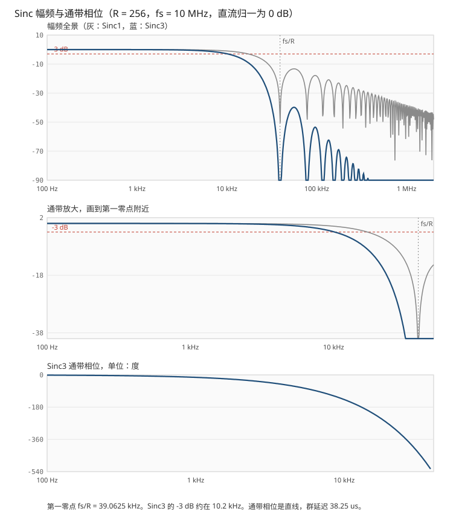

# AMC1035 特性、Sinc3 算法与新旧实现对比

本文说明 SSTMC 工程里五路温度采样所用的 TI AMC1035：芯片在做什么、平均如何变成 Sinc3、频响和伯德图说明了什么，以及 `amc1035_5ch_controller.vhd` 相对原累加器实现改了什么。

手册依据为 AMC1035 数据手册 SBAS837B（2018-08 发布，2020-04 修订）。文中电气指标均指该手册在规定条件下的数值。本工程时钟是 10 MHz，手册典型表征是 20 MHz，两套数字不能直接等同，下文会分开写。

相关代码：

- 当前实现：`YBT_FPGA_SSTMC/amc1035_5ch_controller.vhd`
- 过温比较：`YBT_FPGA_SSTMC/module/Core/FaultCore/fault_prot.vhd`（CH1～CH3 阈值 162/142，CH4～CH5 阈值 176/156）

---

## 1. 芯片在系统里的位置

AMC1035 是单电源精密 ΔΣ 调制器，不是输出并行数字码的传统 ADC。每片只有一路差分输入，DOUT 是与 CLKIN 同步的 1 bit 码流。FPGA 负责提供时钟，并把码流滤成多 bit 温度码。

本工程用五片，五路共用同一路 SCLK。手册把外部时钟当成多通道同步的手段，这样接是符合芯片用法的。五路数据在 FPGA 里并行滤波，不存在“一路算完再算下一路”。

顶层把五路 12 bit 结果送到 `sig_T4O`～`sig_T8O`，由 `fault_prot` 做带滞回的过温确认。`o_valid` 在新数据写出时拉高一拍，顶层没有使用，保护逻辑读的是寄存器里一直保持的最新值。

本实现按 **MCE = 0** 处理 DOUT，即普通比特流，不是曼彻斯特码。若板上 MCE 被拉高，码流里每个 bit 都带时钟沿，当前译码会错。旧累加器同样按普通 0/1 占空比计数，这一点没有变。

---

## 2. 芯片特性

### 2.1 信号链

模拟前端是斩波稳零缓冲，后面接开关电容二阶前馈 ΔΣ 调制器。调制器每个 CLKIN 输出 1 bit：比较器结果经过 1 bit DAC 反馈，使积分器跟踪输入的平均值。量化噪声被推到高频，所以后面必须有低通数字滤波器，既压噪声，也把高速 1 bit 流变成低速多 bit 字。

手册明确写：对这种二阶调制器，Sinc3 在性能和逻辑规模之间最合适。手册全部电气指标都是用 **Sinc3、OSR = 256、输出字宽 16 bit** 测的。

斩波频率是 `fCLKIN / 32`。本工程 `fCLKIN = 10 MHz` 时，斩波杂散在 312.5 kHz。输出数据率是 `10 MHz / 256 = 39.0625 kHz`，312.5 kHz 正好是输出率的 8 倍，落在 Sinc3 的传输零点上。

### 2.2 模拟输入与基准

| 项目 | 手册值 | 含义 |
| --- | --- | --- |
| 线性满量程 | ±1 V（差分，AINP − AINN） | 指标保证区间 |
| 削顶电压 | ±1.25 V | 超出后码流变成几乎全 0 或全 1 |
| 差分输入电阻 | 典型 1.6 GΩ（最小 0.16 GΩ） | 适合电阻分压，分压器负载轻 |
| 输入失调 | 25°C 最大 ±0.5 mV，典型 ±0.03 mV | |
| 失调漂移 | 最大 ±6 µV/°C | |
| 增益误差 | 最大 ±0.25% | |
| 积分非线性 | 16 bit 分辨率下最大 ±12 LSB | |
| REFOUT | 2.5 V，±5 mA，初始精度 2.495～2.505 V | 可给比例测量供电，降低增益温漂 |
| 电源 | 3.0～5.5 V，单电源 | 片内电荷泵产生负向摆幅所需的内部电压 |
| SNR | `fIN = 1 kHz` 时典型 87 dB、最小 81 dB | 条件是 20 MHz 时钟、Sinc3、OSR = 256 |

±1 V 是线性区，不是码流顶满。码流顶满对应约 ±1.25 V。线性区端点的占空比是 10% 和 90%，不是 0% 和 100%。

### 2.3 时钟

| 项目 | MCE = 0（本工程） | MCE = 1（曼彻斯特） |
| --- | --- | --- |
| CLKIN 频率 | 9～21 MHz，典型 20 MHz | 9～11 MHz，典型 10 MHz |
| 占空比 | 40%～60%，典型 50% | 同左 |
| DOUT 变化沿 | CLKIN 上升沿 | 上升沿和下降沿都有编码沿 |
| DOUT 有效延迟 tD1 | 上升沿后最大 25 ns（负载 15 pF） | 另有 tD2 / tD3 |
| DOUT 保持时间 tH1 | 上升沿后至少 6 ns | |

时钟必须连续给。低于规定频率、停钟或丢钟时，电荷泵停止，输入偏置电流变大，输入电阻明显下降，调制器停止转换，DOUT 停在最后的电平。重新来钟后要等内部偏置重新建立（手册的 tASTART）。

本工程 SCLK 为 **10 MHz、占空比 40%**（高 40 ns，低 60 ns）。频率落在 9～21 MHz 以内。占空比卡在手册允许的下限 40%，没有余量。50 MHz 系统钟除以 5 得到 10 MHz，整数分频做不出 50% 占空比。

### 2.4 码流与输入电压

0 V 差分输入时，理想占空比是 50%。+1 V 约 90% 为 1，−1 V 约 10% 为 1。手册给出的 16 bit 无符号对应码分别是 58982 和 6553。

占空比（满幅削顶除外）：

```text
D = (VIN + VClipping) / (2 × VClipping)
VClipping = 1.25 V
```

因此：

| 差分输入 | 1 的比例 | 相对 50% 的偏移 |
| --- | --- | --- |
| −1.25 V 及更负 | 几乎全 0 | 负向削顶 |
| −1 V | 10% | 线性区负端 |
| 0 V | 50% | 零点 |
| +1 V | 90% | 线性区正端 |
| +1.25 V 及以上 | 几乎全 1 | 正向削顶 |

削顶时芯片每 128 个 CLKIN 插入一个相反 bit，用来表示器件仍在工作，同时区分“真的顶满”和“DOUT 断线后卡死”。共模电压超出手册的欠压/过压阈值时，DOUT 被强制拉高，作为失效保护。当前 FPGA **没有单独解码这两种诊断**，只把看到的 0/1 送进滤波器。

---

## 3. 从平均到 Sinc3

调制器每个 CLKIN 吐出 1 bit。10 MHz 下就是每秒一千万个 0 或 1，低频里是电压，高频里是被整形推上去的量化噪声。滤波器要做两件事：把快速跳变抵消掉，并且降低输出速率。

### 3.1 最朴素的做法是求平均

设抽取因子为 `R`。每 `R` 个输入点输出一个平均值：

```text
y[n] = ( x[nR] + x[nR−1] + … + x[nR−(R−1)] ) / R
```

低频几乎不变，平均之后还在。高频在一个窗口里正负相消。

用 `R = 4` 看两个极端。输入是周期刚好为 4 的方波：

```text
+1, −1, +1, −1, …
(+1) + (−1) + (+1) + (−1) = 0
```

这一窗的平均是 0，这个频率被消掉。输入若是慢变化：

```text
1, 1, 1, 1,  2, 2, 2, 2, …
平均后仍是 1, 2, …
```

低频留下来，同时输出点数变成原来的 `1/R`。这就是矩形窗平均加上抽取，也就是一阶 Sinc。

旧代码的 20000 次“数 1”就是这件事：`R = 20000`，窗口里 1 的个数等于把 bit 加起来，再减去中点 10000。它没有写成积分器加差分器，求和再清零的结果与一阶 CIC 在抽取点上的输出相同。

### 3.2 平均在 Z 域里怎么写

长度为 `R` 的滑动求和是等比级数：

```text
H1(z) = 1 + z^(−1) + z^(−2) + … + z^(−(R−1))
      = (1 − z^(−R)) / (1 − z^(−1))
```

归一化平均再乘 `1/R`。上式已经说明一次求和由两段组成：

- 分母 `1 / (1 − z^(−1))`：积分器，`acc = acc + x`，每个输入时钟都做。
- 分子 `1 − z^(−R)`：当前累加值减去 `R` 个输入之前的累加值。

相减之后，中间重复累加的部分消掉，只留下最近 `R` 个输入的和。这就是“总账减旧账”，不必再做 `R` 次加法。

### 3.3 差分为什么可以放到抽取之后

若差分也在高速端做，`z^(−R)` 要记下 `R` 个历史值。`R = 256` 还好，`R = 20000` 就很浪费。

抽取和 `z^(−R)` 可以交换，这是 CIC 省资源的那一步：

- 在高速端，`z^(−R)` 是延迟 `R` 个输入时钟。
- 抽取 `R` 倍之后，输出时钟正好慢 `R` 倍，这 `R` 个输入时钟变成 **1 个输出时钟**。
- 所以低速端只需要 `z^(−1)`：当前抽取值减上一个抽取值。

一阶结构因此是：

```text
x → 积分器（速率 fs）→ 每 R 个取 1 个 → 差分器（速率 fs/R）→ 除以 R → y
```

差分器只存一个数。三阶把这个结构重复三次：高速端三个积分器一直加，抽到低速端之后三个差分器各减自己的上一次。传递函数是：

```text
H(z) = ( (1 − z^(−R)) / (1 − z^(−1)) )^3
```

直流增益是 `R^3`，因为每一级求和大约把幅度乘 `R`，三级就是 `R^3`。归一化滤波器再除以 `R^3`。

本工程的梳状差分就做在抽取之后：积分器每个采样 bit 都更新；满 256 个 bit 才做一次三级差分，延迟寄存器也是每帧更新一次。后面多出来的两拍是定标和温度公式，用来拆开 50 MHz 上的乘法，不是又加了两级滤波器。

### 3.4 频响

归一化之后（直流增益看成 1），N 阶 Sinc 的幅度是：

```text
|H(f)| = | sin(π R f / fs) / ( R sin(π f / fs) ) |^N
```

`fs` 是调制器时钟，本工程 10 MHz。`N = 1` 是旧的矩形窗，`N = 3` 是现在的 Sinc3。

由这个式子直接读出几件事：

- `f = k · fs / R`（k = 1, 2, 3, …）时分子为 0，增益是零。这些频率在伯德图上是无穷深的陷波，画出来会被图的底边截断。
- `f` 远小于 `fs/R` 时，分子分母的正弦都近似等于自己的自变量，比值趋近 1，通带接近 0 dB。
- 阶数在指数上。同一频率上，Sinc3 的分贝数是 Sinc1 的 3 倍。一阶压得不够的地方，三阶会深大约 3 倍。
- 通带边缘的下垂也同样乘 3。三阶通带没有一阶那么平。

`R = 256` 时第一零点在 `10 MHz / 256 = 39.0625 kHz`。按上式算出的数值：

| 频率 | Sinc1 | Sinc3 | 说明 |
| --- | --- | --- | --- |
| 100 Hz | −0.0001 dB | −0.0003 dB | 温度这种慢信号，两者都等于直通 |
| 1 kHz | −0.009 dB | −0.028 dB | 仍可当作 0 dB |
| 5 kHz | −0.24 dB | −0.71 dB | 三阶通带开始下垂 |
| 10.2 kHz | −1.0 dB | **−3.0 dB** | Sinc3 的 −3 dB 带宽 |
| 20 kHz | −4.1 dB | −12.4 dB | 已离开通带 |
| 30 kHz | −11.2 dB | −33.5 dB | 靠近第一零点 39.06 kHz |
| 55.9 kHz | **−13.3 dB** | **−39.8 dB** | 第一旁瓣峰 |
| 96.1 kHz | −17.8 dB | −53.5 dB | 第二旁瓣峰 |
| 136 kHz | −20.8 dB | −62.4 dB | 第三旁瓣峰 |
| 175 kHz | −23.0 dB | −68.9 dB | 第四旁瓣峰 |
| 214 kHz | −24.7 dB | −74.2 dB | 第五旁瓣峰 |

一阶第一旁瓣只比主瓣低 13.3 dB。三阶同一位置是 39.8 dB，正好是 13.3 的三倍。再往高频，三阶以大约每增加一个旁瓣再深几分贝的速度掉下去，一阶则长期停在 −20 dB 附近。二阶调制器把量化噪声推到这些高频旁瓣上，所以手册指定 Sinc3，而不是“数一数有多少个 1”。

抽取之后，零点附近没被消掉的残量会折回基带。第一旁瓣峰在 55.9 kHz，相对输出率 39.0625 kHz 折回来大约落在 16.8 kHz，幅度仍是 −39.8 dB。这是 Sinc3、`R = 256` 时，第一块漏进输出频带的高频增益。

### 3.5 伯德图

下图按 `R = 256`、`fs = 10 MHz` 绘制。纵轴是 `20 log10(|H(f)/H(0)|)`，直流为 0 dB。灰线是 Sinc1，蓝线是 Sinc3。源文件与本文档放在一起：`doc/amc1035_sinc_bode.svg`。



三张图分别是：

1. **幅频全景**，100 Hz 到 2 MHz。蓝线在每个 `k · 39.0625 kHz` 扎到图底，旁瓣一瓣比一瓣低。灰线的第一旁瓣就停在大约 −13 dB，后面下降很慢。−3 dB 红线用来对照通带边缘。
2. **通带放大**，只画到第一零点附近。1 kHz 以下两条线都贴着 0 dB。蓝线大约在 10.2 kHz 穿过 −3 dB，到 30 kHz 已经 −33 dB，然后在 39.0625 kHz 掉进零点。温度过温看的是接近直流的成分，这条下垂对 162、176 这类慢阈值几乎没有增益误差。
3. **通带相位**。第一零点之前，Sinc3 是线性相位，群延迟恒定：

```text
τ = 3 × (R − 1) / 2 / fs = 3 × 255 / 2 / 10 MHz = 38.25 µs
φ = −360° × f × τ
```

1 kHz 时相位约 −13.8°，10.2 kHz 时约 −140°。相位是一条直线，没有在通带里额外扭曲波形，只是整体晚 38.25 µs。零点处实频响变号，相位再跳 180°；那些频率增益已经是零，跳变不进入输出。

和旧矩形窗比，频域上的取舍就在这张图里：

- 旧实现是 Sinc1、`R = 20000`、`fs = 5 MHz`，第一零点在 250 Hz。它的旁瓣也只有 −13 dB 量级，但零点很密，量化噪声所在的高频要穿过很多个零点才进基带，等效噪声带宽大约一百多赫兹。
- 当前是 Sinc3、`R = 256`、`fs = 10 MHz`，第一旁瓣深到 −39.8 dB，但 −3 dB 带宽约 10.2 kHz。调制器噪声压得更好，温度信号本身的快变化也会被放进来。过温计数在阈值附近被噪声打断，就是这 10 kHz 带宽的直接后果。

斩波杂散在 `fCLKIN / 32 = 312.5 kHz`，等于 `8 × fs / R`，正好踩在第 8 个零点上。理想频响在这里是零。有限字长和削顶时每 128 个时钟插入的诊断 bit 会让陷波变浅，但这个频率不是靠旁瓣去压，而是对准了零点。

### 3.6 二阶调制器为什么用三阶 Sinc

AMC1035 的调制器是二阶的。量化噪声传递函数在高频按大约每倍频 40 dB 上升（两阶，每阶约 20 dB/十倍频）。滤波器至少要比噪声整形多一阶，才压得住折回基带的噪声。二阶调制器配三阶 Sinc，是这个数量级上的搭配，也是手册用来测 SNR、INL 的条件。

一阶平均能把“占空比”变成一个数，所以旧代码能工作，直流刻度也是对的。它缺的是阻带：第一旁瓣 −13 dB，挡不住已经被推到高频的量化噪声。时钟又在 5 MHz，低于手册 9 MHz 下限，这个问题比旁瓣更大，见第 6 节。

### 3.7 位宽、回绕，以及本工程没有做的那种“除以 R³”

`R = 256` 时直流增益 `R^3 = 2^24`。1 bit 输入再经过三级积分，累加器至少要：

```text
1 + ceil(3 log2(R)) = 1 + 24 = 25 bit
```

不够的话，差分减完以后的低位不再代表最近 `R` 个样本的和。够的话，积分器按二进制补码回绕是允许的：差分看的是两个回绕数之差，模 `2^位宽` 的差仍然是这段增量。本工程用 32 bit，比 25 bit 多 7 bit，正常码流不会把这个余量用完。

教科书在差分之后除以 `R^3`，把直流增益变回 1，输出落在 0～1，表示这一帧里 1 的比例。本工程不把结果留成这个比例，而是改成和旧温度公式相同的整数：

```text
code = (raw − R^3 / 2) × 10000 / (R^3 / 2)
     = (raw − 2^23) × 10000 / 2^23
```

`raw − 2^23` 把 50% 占空比挪到 0。再除以 `2^23` 并乘 10000，使全 0、全 1 对应 ±10000。除法都是 2 的幂，用算术右移，不生成除法器。这和“除以 `R^3`”差一个常数比例和一个零点平移，频响形状不变，变的是输出数字的零点和满量程。

### 3.8 本工程取的 R

`R = 256 = 2^8`。

| 量 | 计算 | 数值 |
| --- | --- | --- |
| 直流增益 | `R^3` | `2^24 = 16777216` |
| 50% 占空比对应的中点 | `R^3 / 2` | `2^23 = 8388608` |
| 全 1 的梳状输出 | 约 `R^3` | `2^24` |
| 全 0 的梳状输出 | 0 | 0 |
| 输出数据率 | `10 MHz / 256` | 39.0625 kHz |
| 帧周期 | `256 / 10 MHz` | 25.6 µs |
| −3 dB 带宽 | 约 `0.262 × fCLKIN / R` | 约 10.2 kHz |
| 群延迟 | `3 × (R − 1) / 2` 个 CLKIN | 38.25 µs |
| 积分器最少位宽 | `1 + 3 × log2(R)` | 25 bit |

积分器会一直累加并按字长回绕。位宽不小于 25 bit 时，回绕是模运算，三级差分能把结果还原。本工程用 32 bit，留有余量。

Sinc3 在 `k × fCLKIN / R`（k = 1, 2, 3, …）处是传输零点。第一零点在 39.0625 kHz。温度本身是慢变量，10 kHz 带宽远宽于过温保护需要的带宽，这一点在第 6 节作为代价说明。

### 3.9 从梳状结果到 ±10000

梳状输出 `raw` 在全 0 时约为 0，50% 占空比时约为 `2^23`，全 1 时约为 `2^24`。保护逻辑和原来的温度公式认识的是“50% 为 0、码流顶满为 ±10000”，所以定标为：

```text
code = (raw − 2^23) × 10000 / 2^23
```

FPGA 里除以 `2^23` 是算术右移 23 位，不会生成除法器。负数用算术右移，相当于向负无穷取整；在正好整除的顶满点上，全 1 得到 +10000，全 0 得到 −10000，50% 得到 0。

和输入电压的对应关系（理想占空比，未计芯片增益误差和诊断 bit）：

| 差分输入 | 1 的比例 | `code` |
| --- | --- | --- |
| −1.25 V（削顶） | 100% 为 0 | −10000 |
| −1 V（线性区负端） | 10% | −8000 |
| 0 V | 50% | 0 |
| +1 V（线性区正端） | 90% | +8000 |
| +1.25 V（削顶） | 100% 为 1 | +10000 |

线性区只用了 ±8000，不是 ±10000。±10000 是削顶，不是 ±1 V。

### 3.10 温度标定

`code` 还不是过温比较用的 12 bit 数。原工程在“减掉 10000 个 1”之后做了线性标定，本实现把 `code` 放在同一个位置上：

```text
CH1～CH3：  temp = (code × 785  − 5797)  / 16384
CH4～CH5：  temp = (code × 938  − 14089) / 16384
```

除以 16384 是右移 14 位，负数按向 0 截断，与原先 VHDL 整数除法一致。结果饱和到 12 bit 有符号数（−2048～2047）。

按上面的理想 `code` 代入，整数结果是：

| `code` | 含义 | CH1～CH3 | CH4～CH5 |
| --- | --- | --- | --- |
| 0 | 0 V，50% | 0 | 0 |
| 8000 | +1 V，90% | 383 | 457 |
| 10000 | 正向削顶 | 478 | 571 |
| −8000 | −1 V，10% | −383 | −458 |

过温阈值 162、176 都落在 0 和 383 之间，也就是 0 V 和 +1 V 之间的线性区，不是削顶区。这些系数是原标定留下的，VHDL 里没有传感器分压或 NTC 曲线，所以 12 bit 数是工程码，不是手册上的摄氏度。阈值能继续用，是因为直流刻度和旧公式对齐，不是因为重新标定过。

以 CH1 为例，`temp ≈ 162` 时 `code ≈ 3389`，理想占空比约 67%，对应芯片管脚差分电压约 0.42 V。这只是公式反推，传感器前端的分压不在本文件里。

### 3.11 四级流水

50 MHz 时钟周期是 20 ns。若在同一拍里做完三级积分、三级差分、乘 10000 和温度乘法，进位链会叠在一起。两次比特采样之间有 5 个 50 MHz 时钟，所以拆开之后仍然来得及：

| 拍 | 做什么 | 这一拍的组合深度 |
| --- | --- | --- |
| 1 | 五路各做三级积分，并寄存 | 三级 32 bit 加法 |
| 2 | 满 256 bit 时做三级梳状差分，并寄存 | 三级 32 bit 减法 |
| 3 | `(raw − 2^23) × 10000`，再右移，得到 `code` | 一次乘法 |
| 4 | `(code × gain − bias)`，右移 14 位，写 12 bit，拉高 `o_valid` | 一次乘法 |

五路在每一拍里是并行的。`for` 循环综合成五套硬件，不是五路串行。拆成五个进程不会缩短关键路径。

结果比“差分完成的那一拍”晚 3 个 50 MHz 时钟，约 60 ns。相对 25.6 µs 的帧周期可以忽略。

复位后前两帧的梳状差分器用的是清零初值，结果丢掉。两帧约 51 µs。这段时间输出保持 0，`o_valid` 不起。

---

## 4. 当前实现的接口时序

系统钟是 50 MHz，不把 10 MHz 再当作 FPGA 内部时钟。SCLK 只是送到芯片的输出，采样用时钟使能。

分频计数 0～4，在计数变为 1 时拉高 SCLK，变为 3 时拉低，计到 5 折回 0：

- 高电平：2 拍，40 ns
- 低电平：3 拍，60 ns
- 频率：10 MHz
- 占空比：40%

采样使能是“分频计数为 0 且 SCLK 仍为低”的那一拍，也就是 SCLK 即将上升的前一个 50 MHz 沿。DOUT 先经两级触发器同步，滤波器用的是同步后的 bit。两级同步大约 40 ns。

手册要求用 CLKIN 上升沿锁存 DOUT，并且 DOUT 在上升沿之后最多 25 ns 才有效。本实现不是在芯片上升沿的同一瞬间去锁新 bit，而是在低电平末尾读取已经稳定过的同步结果。低电平有 60 ns，大于手册最大有效延迟 25 ns，从延迟数字上看，低电平期间数据有时间稳定。这是和旧累加器相同的采样相位思路，并不是手册推荐接收器（如 AMC1210）那种“沿对沿”锁存。板级走线和隔离器额外延迟不在本文件的约束里。

---

## 5. 旧实现

旧文件在 50 MHz 上做 10 分频：计数到 1 拉高，到 6 拉低，到 10 回 0。SCLK 为 **5 MHz、占空比 50%**。五路仍共用这一路时钟。

滤波器是长度 20000 的 1 计数，也就是 Sinc1 矩形窗：

```text
diff = (这一帧里 1 的个数) − 10000
temp = (diff × gain − bias) / 16384
```

`gain`、`bias` 与现在相同。更新率 `5 MHz / 20000 = 250 Hz`，帧周期 4 ms。矩形窗的第一零点在 250 Hz，等效噪声带宽大约是帧率的一半，约 125 Hz。群延迟约半帧，2 ms。

旧进程在帧结束的那个时钟读取计数值时，本拍的 `+1` 尚未写回寄存器，读到的是加 1 之前的值，随即把计数器清零。帧边界上的那一个 bit 被丢掉。长帧里这是 1/20000 的误差，但和“每个 bit 都进入积分器”不是同一件事。

定标使用 VHDL 整数除法 `/ 16384`。16384 虽是 2 的幂，写法本身会让综合器按除法理解。当时还使用了 `std_logic_arith` / `std_logic_signed`。

`OUT_VALID` 在定标流水的最后一拍拉高，顶层同样没有接。

---

## 6. 对比与优劣

### 6.1 数字对照

| 项目 | 旧实现 | 当前实现 |
| --- | --- | --- |
| 芯片时钟 | 5 MHz，占空比 50% | 10 MHz，占空比 40% |
| 相对手册 | 低于 9 MHz 下限 | 频率合格，占空比在 40% 下限上 |
| 滤波器 | Sinc1，数 20000 个 1 | Sinc3，OSR = 256 |
| 与二阶调制器的匹配 | 阻带衰减不够 | 手册指定的滤波器和 OSR |
| 更新率 | 250 Hz | 39.0625 kHz |
| 帧周期 | 4 ms | 25.6 µs |
| −3 dB 量级带宽 | 零点在 250 Hz，噪声带宽约 125 Hz | 约 10.2 kHz |
| 群延迟 | 约 2 ms | 约 38 µs，再加 60 ns 流水 |
| 零点刻度 | 减 10000 | 减 `2^23` 再缩放到 ±10000 |
| 顶满刻度 | 0% / 100% 占空比对应 ±10000 | 相同 |
| 温度公式 | `(diff × gain − bias) / 16384` | 相同，除法改为移位 |
| 输出 | 12 bit，通道系数不变 | 相同 |
| 帧边界 | 结束拍的那一个 bit 不计入 | 每个采样 bit 都进入积分器 |
| 启动 | 第一帧就是半截计数 | 丢掉前两帧 |
| 内部时钟 | 50 MHz 上的使能 | 相同，没有把 SCLK 当作 FPGA 时钟 |
| 五路结构 | 一个进程里五路计数 | 一个进程里五路并行，综合结果仍是五套硬件 |
| 诊断 bit / 共模失效 | 不识别 | 不识别 |

直流刻度是对齐的：同样的恒定占空比，送进温度公式的那个整数与旧式 `1 的个数 − 10000` 一致。所以过温阈值 162/142、176/156 在稳定直流下意义不变。

### 6.2 当前实现更好的地方

1. **时钟进入芯片允许范围。** 5 MHz 低于手册 9 MHz 下限。低于下限时电荷泵不保证工作，输入电阻下降，转换本身不可靠。10 MHz 在 9～21 MHz 之内，芯片可以按手册工作。这是这次修改里最重要的一点。
2. **滤波器与调制器阶数匹配。** 二阶调制器配合 Sinc3 是手册的表征条件，OSR = 256 也是指标表使用的抽取比。Sinc1 只相当于滑动平均，高频量化噪声残留更大。
3. **每个 bit 都参与运算**，不再丢掉帧尾那一个 bit。
4. **除法是移位。** 定标和温度标定都落在 2 的幂上，综合不会再推断多周期除法器。50 MHz 下每一拍只有三级加法或一次乘法。
5. **启动瞬态被丢掉。** Sinc3 前两帧差分结果无意义，不写进过温通道。
6. **延迟从毫秒级降到几十微秒。** 若以后要把读数用于更快的保护或录波，数据是新的。对现在这种 3 秒确认的过温，这项本身不是必须的。

### 6.3 当前实现付出的代价

1. **带宽大约从 100 Hz 量级变到约 10 kHz，温度码会明显更“毛”。** 第 3.4 节的表和第 3.5 节的伯德图给出定量结果：Sinc3 在 10.2 kHz 为 −3 dB，第一旁瓣 −39.8 dB；旧 Sinc1 的第一零点在 250 Hz，旁瓣只有约 −13 dB，但零点密，慢信号被平均得很狠。过温确认要连续约 3 秒高于动作阈值；一旦跌回恢复阈值以下，确认计数清零。读数在 162 附近来回抖时，计时可能一直攒不满，该保护时不动作；也可能在阈值附近把计时反复打掉。旧的 20000 点矩形窗把这种抖动平均掉了。Sinc3 本身是对的，但 OSR = 256 对“慢温度、怕阈值抖动”偏快。若现场温度码跳动大，应加大 OSR，或在 12 bit 输出后再做一级慢滤波，而不是退回 5 MHz。
2. **占空比 40% 没有余量。** 手册允许 40%～60%。高电平只有 40 ns。频率合格，占空比停在边界上。
3. **手册上的 87 dB、82 kSPS 不能直接拿来当本设计的指标。** 那些数字是 20 MHz、Sinc3、OSR = 256 测的。本设计是 10 MHz，输出率 39.0625 kSPS。另外后面还有整数定标和 12 bit 饱和，16 bit 滤波器字长里的低位并没有保留到保护接口上。
4. **削顶诊断和共模失效没有单独的故障位。** 削顶时每 128 个时钟插入的一个相反 bit，会让 256 点帧里大约两个 bit 偏离全 0 或全 1，`code` 略离开 ±10000。共模失效时 DOUT 恒为 1，滤波器会给出接近正向削顶的温度码，有可能走进过温，但这不是一条明确的“传感器失效”标志，断线和真实高温在码上看起来都偏大。
5. **采样沿不是手册字面上的上升沿锁存。** 低电平 60 ns 大于 DOUT 最大有效延迟，但没有把隔离器、走线和 40% 占空比放进时序约束里复核。

### 6.4 不该当成优点或缺点的部分

- 五路写在一个进程里，还是拆成五个进程，不改变关键路径。综合后都是五套并行加法器和乘法器。
- 四拍流水晚 60 ns，相对 25.6 µs 的更新周期不是指标差异。
- 实体改名、端口改成 `i_` / `o_`、顶层直接例化，只影响书写和综合工程的接法，不改变滤波结果。

---

## 7. 和 AMC1305 的关系

电压通道 `amc1305_16bit_controller.vhd` 使用同一套 Sinc3 骨架：OSR = 256、32 bit 积分、减 `2^23`、缩放到 ±10000、丢掉前两帧。不同之处是：

| 项目 | AMC1305（电压） | AMC1035（温度） |
| --- | --- | --- |
| 系统钟 | 120 MHz | 50 MHz |
| 芯片时钟 | 20 MHz，占空比 50% | 10 MHz，占空比 40% |
| 流水 | 积分、差分、定标共 3 拍 | 再加一拍温度标定，共 4 拍 |
| 输出 | 16 bit，±10000 即最终码 | 12 bit 工程温度码 |
| 手册线性区 | 视具体型号，码流顶满不是线性区端点 | ±1 V 对应约 ±8000，±1.25 V 才接近 ±10000 |

两边都不能把“±10000”理解成芯片线性满量程。

---

## 8. 参考

- Texas Instruments, *AMC1035 Precision Delta-Sigma Modulator With Bipolar Input of ±1 V and Reference Output of 2.5 V*, SBAS837B, revised April 2020. 时钟、占空比、±1 V / ±1.25 V、占空比–电压关系、Sinc3 与 OSR = 256 的表征条件、SNR、REFOUT、停钟行为均来自该手册。
- 工程实现：`YBT_FPGA_SSTMC/amc1035_5ch_controller.vhd`
- 过温阈值：`YBT_FPGA_SSTMC/module/Core/FaultCore/fault_prot.vhd`
- 第 3.4 节的分贝数和第 3.5 节的伯德图由归一化 Sinc 幅度公式在 `R = 256`、`fs = 10 MHz` 下算出，图文件为 `doc/amc1035_sinc_bode.svg`。不是手册里的实测 SNR 曲线。
